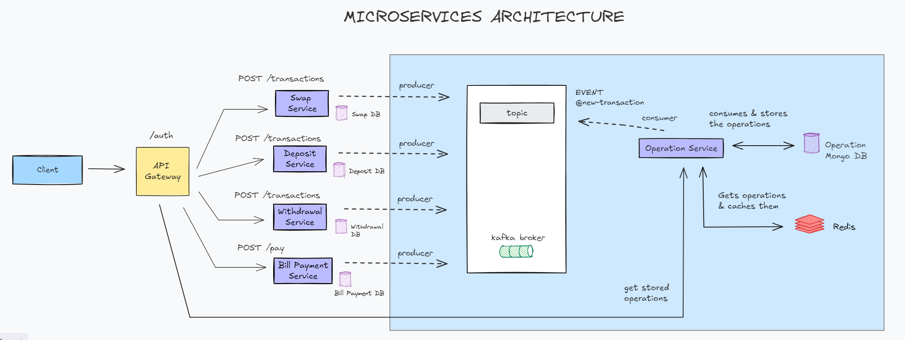

## 📝 SISTEMA ACTUAL

En el sistema actual (representado en la imagen debajo), existe una base de datos centralizada que contiene todas las transacciones y operaciones del sistema. En caso de que se genere una falla, quedarían sin disponibilidad todas las funcionalidades, incluyendo la lectura de datos.

Esta estructura a su vez tampoco permite escalar por funcionalidad, ya sea para procesamiento del servidor o tamaño/consumo de recursos de la base de datos.


## 🔄 SOLUCIÓN IMPLEMENTADA

La solución propuesta propone migrar el sistema actual a una arquitectura de microservicios, donde exista un api gateway que funcione de validador/autenticador y que permita redistribuir las peticiones hacia los diferentes microservicios.

Se crearán microservicios independientes para cada tipo de transacción (Swap, Deposit, Withdrawal, Bill Payments). Cada servicio almacenará en su propia base de dato parte de la información de las transacciones y notificarán, a través de un topic Kafka, las nuevas transacciones existentes en la aplicación.

También se propone implementar un microservicio Operaciones centralizado, el cual consumirá los eventos de los diferentes servicios para luego almacenar y disponibilizar la información de todas las operaciones.

Las operaciones quedarán registradas en una base de datos MongoDB, y el servicio tendrá un endpoint disponible para consumir las transacciones de tipo Bill Payment. Además, para optimizar la performance de dicho servicio se almacenarán las operaciones en una base de datos en memoria utilizando Redis.




En el código entregado se implementó la sección marcada en celeste del diagrama, entendiendo que el challenge propone diseñar una mejora haciendo foco en las manera de almacenar y disponibilizar las operaciones del sistema.

Esta implementación mejora varios puntos contra la arquitectura actual:

- Escalabilidad: Cada microservicio puede escalar sus recursos de forma independiente.
- Resiliencia: Si un microservicio falla, no afecta a los demás.
- Consistencia eventual: Los datos pueden estar temporalmente inconsistentes, pero eventualmente se sincronizarán.
- Flexibilidad: Fácil de agregar nuevos tipos de transacciones sin modificar la estructura existente.


## 📢 SOLUCIÓN ALTERNATIVA (propuesta incremental)

Esta propuesta, es una solución alternativa incremental, suponiendo que el sistema actual se encuentra productivo y se necesita poder liberar rápidamente la capa de operaciones del monolito actual. La propuesta consta de implementar el nuevo microservicio de Operaciones conviviendo con el monolito actual, y permitiendo desacoplar la carga de las  operaciones.

Esta solución permitiría realizar una implementación más rápida, y contar con buena parte de los beneficios mencionados anteriormente a nivel arquitectura.

// --------------------------------------------

## PARA REALIZAR PRUEBAS, SEGUIR LOS SIGUIENTES PASOS:

## Create all services

```bash
$ docker compose up -d
```

## Running the app

```bash
# development
$ npm run start

# watch mode
$ npm run start:dev

# production mode
$ npm run start:prod
```

## For technical testing

Ver file "readme.topic-messages.md" con mensajes para enviar al topic desde la consola.

```bash
# KAFKA
# Enter to kafka container to send messages
$ docker exec -it lemon-challenge-kafka-1 bash

#REDIS
# Enter to redis container to review cached data
$ docker exec -it cache bash
$ redis-cli
$ KEYS *
```


